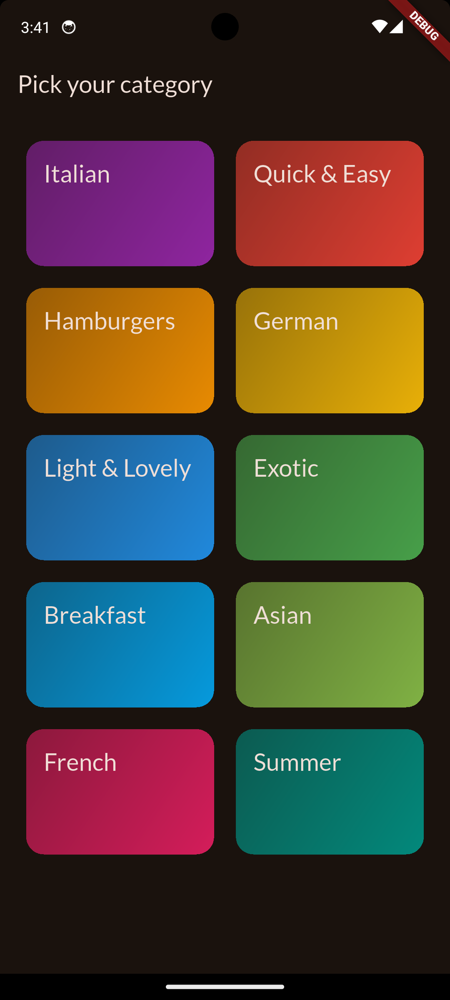

# meal-app

A Flutter application for meal planning and management.

## Overview

A multi-screen app that lets users navigate between screens using screen
stacks, tab bars and a side drawer.

> **Status:** early development. The scaffold, dark Material 3 theme with Lato
> typography, tooling and CI are in place; the Categories screen is built; other screens below are planned.

## Screenshots

<p align="center">
  
</p>

*Categories screen: a grid of gradient tiles on the dark Material 3 theme.*

## Features

- **Screen stacks:** push and pop screens with the Navigator
- **Tab bars:** switch between related views within a screen
- **Side drawer:** jump between top-level screens from anywhere
- **Google Fonts:** Lato typography via the `google_fonts` package
- **Material 3 dark theme** generated from a seed color
- Meal planning and management (planned)

## Planned screens

| Screen | Purpose |
| --- | --- |
| Home | Entry point and overview |
| Meals | Browse and manage meals |
| Planner | Plan meals across the week |
| Settings | App preferences |

The drawer links to each top-level screen, tab bars switch views within a
screen, and detail screens are pushed on top of the stack with the Navigator.

## Tech stack

- [Flutter](https://flutter.dev) 3.47.6 (pinned in `pubspec.yaml`) / Dart 3.13
- Material 3 via [`material_ui`](https://pub.dev/packages/material_ui) (Flutter 3.47
  moved Material out of the framework, so import
  `package:material_ui/material_ui.dart`, not `package:flutter/material.dart`)
- [`google_fonts`](https://pub.dev/packages/google_fonts) 9 for typography
- [`cupertino_icons`](https://pub.dev/packages/cupertino_icons) 2
- GitHub Actions for CI, Dependabot for dependency updates

## Getting started

Prerequisites: the Flutter SDK version pinned in `pubspec.yaml`.

```sh
git clone git@github.com:binarytracer/meal-app.git
cd meal-app
flutter pub get
flutter run
```

## Quality checks

CI runs on every push to `main` and on pull requests. Run the same checks
locally before pushing:

```sh
dart format --output=none --set-exit-if-changed .
flutter analyze --fatal-infos
flutter test
```

The analyzer runs in strict mode (`strict-casts`, `strict-inference`,
`strict-raw-types`) with extra lint rules; see `analysis_options.yaml`.

## Project structure

Planned feature-first layout under `lib/` (currently `main.dart` and `core/theme/app_theme.dart`):

```
lib/
├── core/                 # shared theme, routing, widgets
└── features/<feature>/   # data / domain / presentation per feature
```

## Roadmap

- [ ] App shell: side drawer and screen stack navigation
- [ ] Tab bar views
- [x] Add `google_fonts` and apply a custom text theme
- [ ] Meal list and detail screens
- [ ] Weekly planner
- [ ] Choose state management and persistence
- [ ] Widget tests for each screen
- [ ] Automated Android build and release in CI

## Development tooling

The repo includes Cursor/VS Code settings (`.vscode/`) and AI project rules
(`.cursor/rules/`) tuned for Flutter.

### Recommended editor extensions

Listed in `.vscode/extensions.json`, so VS Code/Cursor will offer to install
them when you open the project:

| Extension | ID | Purpose |
| --- | --- | --- |
| Dart | `Dart-Code.dart-code` | Dart language support, analysis, formatting |
| Flutter | `Dart-Code.flutter` | Flutter tooling: run/debug, hot reload, widget inspector |
| Error Lens | `usernamehw.errorlens` | Shows analyzer errors and warnings inline on the line |
