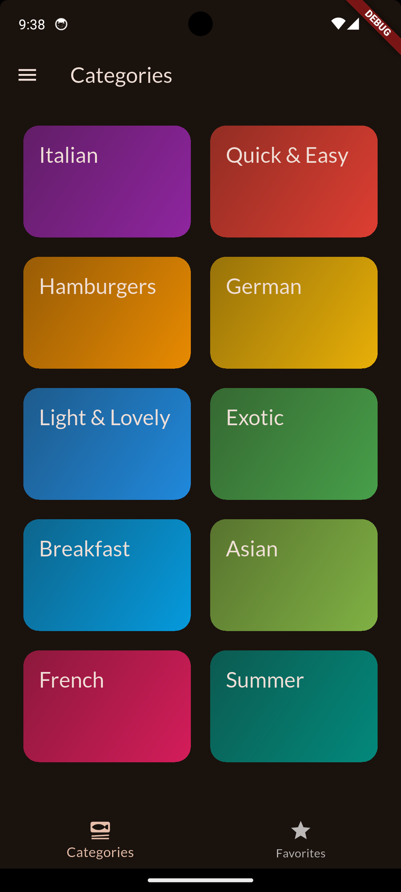
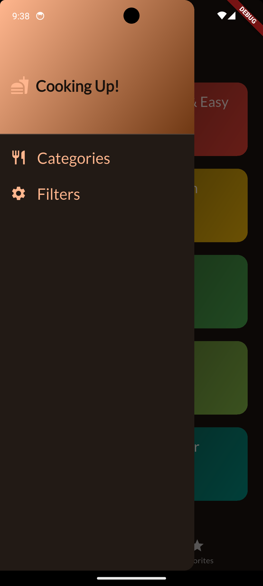
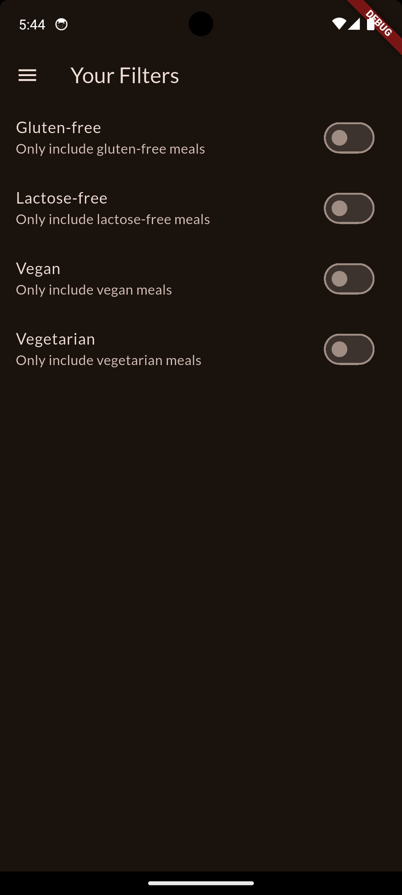

# meal-app

A Flutter application for meal planning and management.

## Overview

A multi-screen app that lets users navigate between screens using screen
stacks, tab bars and a side drawer.

> **Status:** early development. The scaffold, dark Material 3 theme with Lato
> typography, tooling and CI are in place. Categories, meal list, meal detail,
> favorites, the bottom navigation bar and the side drawer are built; the
> drawer links and the other screens below are not wired up yet.

## Screenshots

<p align="center">
  
  
  
  
</p>

*Left to right: the Categories grid on the dark Material 3 theme, the same
screen inside the tab bar (Categories / Favorites) with the drawer button, the
side drawer, and the Filters screen.*

## Features

- **Screen stacks:** push and pop screens with the Navigator
- **Bottom navigation bar:** switch between Categories and Favorites
- **Side drawer:** "Cooking Up!" drawer with Categories and Filters entries
  (navigation from the drawer is not wired up yet)
- **Favorites:** star a meal on its detail screen to add or remove it; the
  Favorites tab updates immediately
- **Image fallback:** a placeholder icon is shown if a meal photo fails to load
- **App-wide state management:** [Riverpod](https://riverpod.dev) providers
  hold shared state (the meal list, favorites, filters) so any screen can read
  it without passing callbacks down the widget tree
- **Google Fonts:** Lato typography via the `google_fonts` package
- **Material 3 dark theme** generated from a seed color
- Meal planning and management (planned)

## Planned screens

| Screen | Purpose |
| --- | --- |
| Home | Entry point and overview |
| Meals | Browse and manage meals |
| Planner | Plan meals across the week |
| Settings | App preferences |

The drawer will link to each top-level screen, the bottom navigation bar
switches between Categories and Favorites, and detail screens are pushed on top
of the stack with the Navigator.

## Tech stack

- [Flutter](https://flutter.dev) 3.47.6 (pinned in `pubspec.yaml`) / Dart 3.13
- Material 3 via [`material_ui`](https://pub.dev/packages/material_ui) (Flutter 3.47
  moved Material out of the framework, so import
  `package:material_ui/material_ui.dart`, not `package:flutter/material.dart`)
- [`flutter_riverpod`](https://pub.dev/packages/flutter_riverpod) 3 for
  app-wide state management
- [`google_fonts`](https://pub.dev/packages/google_fonts) 9 for typography
- [`cupertino_icons`](https://pub.dev/packages/cupertino_icons) 2
- [`transparent_image`](https://pub.dev/packages/transparent_image) for fade-in meal photos
- GitHub Actions for CI, Dependabot for dependency updates

## State management

The app uses [Riverpod](https://riverpod.dev) as its app-wide state solution.
`main.dart` wraps the app in a `ProviderScope`, and providers live in
`lib/providers/`:

| Provider | Type | Holds |
| --- | --- | --- |
| `mealsProvider` | `Provider<List<Meal>>` | The read-only list of all meals |
| `favoritesProvider` | `StateNotifierProvider<FavoritesNotifier, List<Meal>>` | The favorite meals and the logic to toggle them |
| `filtersProvider` | `StateNotifierProvider<FiltersNotifier, Map<Filter, bool>>` | Which dietary filters are switched on (gluten-free, lactose-free, vegetarian, vegan) |
| `filteredMealsProvider` | `Provider<List<Meal>>` | The meals that pass the active filters. Derived from `mealsProvider` and `filtersProvider` |

Providers can be built from other providers: `filteredMealsProvider` watches
`mealsProvider` and `filtersProvider`, so it recomputes automatically whenever a
filter is toggled and every widget watching it rebuilds. The filtering logic
lives in one place and can be unit tested without any UI.

### Where each provider is used

| Screen / widget | Provider | How |
| --- | --- | --- |
| `TabsScreen` | `filteredMealsProvider`, `favoritesProvider` | Categories tab shows the filtered meals; Favorites tab shows the favorites |
| `FiltersScreen` | `filtersProvider` | Watches the map for the switch values; calls `setFilter` when a switch is toggled |
| `MealDetail` | `favoritesProvider` | Watches it to fill or outline the star; calls `toggleMealFavoriteStatus` from the star button and shows a snackbar from the result |

Because the state lives in providers and not in widgets, a change made on one
screen (for example switching on a filter) is reflected on every other screen
that watches it, with no callbacks passed down the widget tree.

### Usage

Read state and rebuild when it changes (inside `build`):

```dart
final filters = ref.watch(filtersProvider);
SwitchListTile(value: filters[Filter.vegan] ?? false, ...);
```

Change state through the notifier (inside callbacks, never in `build`):

```dart
ref.read(filtersProvider.notifier).setFilter(Filter.vegan, isChecked);
```

A notifier owns the logic for changing its state:

```dart
class FiltersNotifier extends StateNotifier<Map<Filter, bool>> {
  FiltersNotifier() : super({/* all filters start off */});

  void setFilter(Filter filter, bool isActive) {
    state = {...state, filter: isActive}; // new map, so watchers rebuild
  }
}
```

Conventions:

- Read state in widgets with `ref.watch(provider)`; call actions with
  `ref.read(provider.notifier).method()`.
- Inside a provider, use `ref.watch` (not `ref.read`) to depend on another
  provider so the result stays up to date.
- Never mutate `state` in place. Assign a new object (`state = [...state, meal]`)
  so listeners rebuild.
- Screens that use providers extend `ConsumerWidget` / `ConsumerStatefulWidget`.
- Riverpod 3 moved `StateNotifier` to `package:flutter_riverpod/legacy.dart`.
  New code should prefer `Notifier`.

Local UI state that no other screen needs, such as the selected bottom-tab
index, stays in a plain `setState`.

## Getting started

Prerequisites: the Flutter SDK version pinned in `pubspec.yaml`.

```sh
git clone git@github.com:binarytracer/meal-app.git
cd meal-app
flutter pub get
flutter run
```

## Quality checks

CI runs on every push to `main` and on pull requests. Run the same checks
locally before pushing:

```sh
dart format --output=none --set-exit-if-changed .
flutter analyze --fatal-infos
flutter test --coverage
```

Tests live in `test/`: unit tests for the providers (`test/providers/`) and
widget tests for the screens (`test/widget_test.dart`). Provider logic is tested
with a `ProviderContainer`; widgets are wrapped in a `ProviderScope`.

CI also reads `coverage/lcov.info`, prints the line coverage in the run summary
and fails if it drops below `MIN_COVERAGE` in `.github/workflows/ci.yml`.
Raise that number as tests are added so coverage can only go up.

The analyzer runs in strict mode (`strict-casts`, `strict-inference`,
`strict-raw-types`) with extra lint rules; see `analysis_options.yaml`.

## Project structure

Current layout under `lib/` (a feature-first split is planned as the app grows):

```
lib/
├── core/theme/    # app theme
├── data/          # dummy categories and meals
├── models/        # Category, Meal
├── providers/     # Riverpod providers (meals, favorites, filters)
├── screens/       # tabs (bottom navigation), categories, meals, filters
└── widgets/       # drawer, category tile, meal item, meal detail, image fallback

test/
├── providers/     # unit tests for the Riverpod providers
└── widget_test.dart
```

## Roadmap

- [x] Screen stack navigation
- [x] Bottom navigation bar (Categories / Favorites)
- [x] Side drawer UI
- [ ] Wire up drawer navigation and the Filters screen
- [x] Add `google_fonts` and apply a custom text theme
- [x] Meal list and detail screens
- [x] Favorites (in memory)
- [ ] Weekly planner
- [x] Choose state management (Riverpod)
- [x] Move favorites and filters onto Riverpod providers
- [ ] Persistence
- [x] Unit tests for the providers and test coverage report in CI
- [ ] Widget tests for each screen
- [ ] Automated Android build and release in CI

## Development tooling

The repo includes Cursor/VS Code settings (`.vscode/`) and AI project rules
(`.cursor/rules/`) tuned for Flutter.

### Recommended editor extensions

Listed in `.vscode/extensions.json`, so VS Code/Cursor will offer to install
them when you open the project:

| Extension | ID | Purpose |
| --- | --- | --- |
| Dart | `Dart-Code.dart-code` | Dart language support, analysis, formatting |
| Flutter | `Dart-Code.flutter` | Flutter tooling: run/debug, hot reload, widget inspector |
| Error Lens | `usernamehw.errorlens` | Shows analyzer errors and warnings inline on the line |
